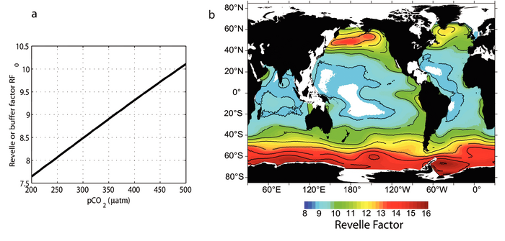

```{r setup, include=FALSE}
library(learnr)
library(knitr)
library(tutorial.helpers)
library(seacarb)
library(marelac)
knitr::opts_chunk$set(echo = FALSE)
knitr::opts_chunk$set(out.width = '90%') 
```

## Overview

The aim of today is to show you how you can use R to calculate ocean chemistry variables. We will calculate oxygen solubility in seawater, and evaluate how increasing temperatures change oxygen solubility. We will learn how to calculate an sea-air gas flux using the data we collected on the Polaris II, and we will end by exploring the marine carbonate chemistry system, using R to derive the Revelle factors, and see how this applies to our field site. 

Before anything else, make sure you fill in your name and ID in the next field.

```{r info-section, child = system.file("child_documents/info_section.Rmd", package = "tutorial.helpers")}
```

## Purpose and outcomes of activity

By the end of today's session, you should be able to:

\* use R to calculate the solubility of a gas in seawater

\* calculate the air-sea gas flux of CO2

\* use R to solve the marine carbonate chemistry system

\* derive the 'Revelle' or buffer factors for marine CO2 uptake

## Ocean deoxygenation - background (15 minutes)

In the monday lecture we discussed how salinity and temperature control the solubility of gasses in seawater. Can you remember what the links where?
```{r ocean-deoxygenation-1, echo=FALSE}
question("Which of the following statements are correct?",
  answer("Gas solubility increases with decreasing temperature", correct = TRUE),
  answer("Gas solubility decreases with increasing salinity", correct = TRUE),
  answer("Gas solubility increases with increasing salinity"),
  answer("Gas solubility decreases with decreasing temperature"),
  random_answer_order = TRUE,
  allow_retry = TRUE
)
```

The link between changing temperatures and gas solubility is incredibly relevant and topical when it comes to oxygen. Take a few minutes to look at the figure below, which is taken from a paper in Science (Breitburg et al., 2018, https://www.science.org/doi/10.1126/science.aam7240). It shows the different areas in the world that are experiencing low oxygen conditions and hypoxia. Some of these areas will only experience this seasonally, when waters become stratified as the surface heats up. Other are permanently low in oxygen ('oxygen-minimum-zones'), which is generally because of upwelling that brings nutrients to the surface, which leads to high productivity in the surface, and a lot of oxygen consumption in the deeper layers as all that organic matter gets exported (refer to the Monday lecture for more details). 

{width="18cm"}

Take a look at the figure again, and find Aotearoa/New Zealand. Are there low oxygen zones indicated? Does that make sense? keep your answer short and make it fit within the box.
```{r ocean-deoxygenation-2}
  question_text("What area is indicated as a low oxygen zone in Aotearoa/New Zealand? Does that make sense? Why?",
    answer(NULL, correct = TRUE),
    allow_retry = TRUE,
    try_again_button = "Edit Answer",
    incorrect = NULL,
    rows = 5)
```

Now proceed to the next step.

## Calculating gas solubility in the ocean (20 minutes)

The solubility of a gas is dependent on salinity and temperature. R has quite a convenient package called 'marelac' (https://cran.r-project.org/web/packages/marelac/marelac.pdf), which has a lot of conversions, constants, equations etc. that are useful for aquatic science (marelac = MArine, Riverine, Estuarine, LAcustrine, and Coastal science). We will use the function 'gas_O2sat' from this package to calculate the saturation concentration of oxygen in water. 
Run the code below to get the oxygen concentration in water.
```{r ocean-deoxygenation-3, exercise=TRUE}
O2conc <- gas_O2sat()
print(O2conc)
```
Remember from previous R courses, when you call a function without providing any parameters, it will use the default values. In the case of 'gas_O2sat', it will assume a salinity of 35 and a temperature of 25 degrees Celsius. If we want to choose our parameters, we need to name them explicitly. The code below calls the parameter for salinity ('S') and for temperature ('t') explicitly.
Change the temperature to 15 degrees Celsius - what concentration do you get now?
```{r ocean-deoxygenation-4, exercise=TRUE}
WaterSal    <- 35  # [-]
WaterTemp   <- 25  # deg Celsius

O2conc <- gas_O2sat(S=WaterSal,t=WaterTemp)
print(O2conc)
```
```{r ocean-deoxygenation-5, echo=FALSE}
question("What is the O2 concentration for a temperature of 15 degrees Celsius??",
  answer("6.75"),
  answer("8.12", correct = TRUE),
  answer("7.56"),
  random_answer_order = TRUE,
  allow_retry = TRUE
)
```

The oxygen concentration is reported in mg $O_2$/L. In biogeochemistry, it makes more sense to report concentration in moles/L (as we discussed during the first week labs, and also in some of the lectures). To convert from grams to moles, we need to use the molecular weigh of oxygen. Conveniently, marelac has another function called 'molweight' which gives us the molecular weight of any molecule:
```{r ocean-deoxygenation-6, exercise=TRUE}
O2molweight <- molweight("O2")
print(O2molweight)
```
The molecular weight is given in g/moles. If we add this to our calculation, we get
```{r ocean-deoxygenation-7, exercise=TRUE}
WaterSal    <- 35  # [-]
WaterTemp   <- 25  # deg Celsius
O2molweight <- molweight("O2") # g/mol

O2conc <- gas_O2sat(S=WaterSal,t=WaterTemp)/O2molweight
print(O2conc)
```
What units is the reported oxygen concentration in now? Remember that gas_O2sat returns a value in mg $O_2$/L, and the molecular weight is given in g/moles. Putting that together gives us
$$ \frac{mg \ O_2}{L} / \frac{g}{moles} $$
```{r ocean-deoxygenation-8, echo=FALSE}
question("What are the units for the O2 concentration?",
  answer("mmol O2/L", correct = TRUE),
  answer("mg O2/g"),
  answer("mg O2/mol"),
  random_answer_order = TRUE,
  allow_retry = TRUE
)
```

We now know how to calculate the fully air-saturated concentration of oxygen in seawater, and we can convert it to the correct units (mmol $O_2$/L). Let us now use this to estimate the change in oxygen concentration with ongoing ocean warming.
The code below generates a vector of temperatures (the min-max annual range experienced at Portobello Marine Lab), and then for each of those temperatures calculates the saturation concentration of oxygen. It also prints out the calculated concentration vector. Run the code and see how the saturation concentration changes with increasing temperature.

```{r ocean-deoxygenation-9, exercise=TRUE}
WaterTemp   <- c(5,7,9,11,13,15,17,19) # deg Celsius
WaterSal    <- 35  # [-]
O2molweight <- molweight("O2")         # g/mol

O2conc <- gas_O2sat(S=WaterSal,t=WaterTemp)/O2molweight

plot(x=WaterTemp,y=O2conc,pch=16,col="black",
     xlab=expression("Temperature ("~degree*C*")"),ylab=expression("[O"['2']*"] (mmol/L)"))
print(O2conc)
```
We are interested in finding out when seawater becomes 'hypoxic'. Below this oxygen concentration, the normal functioning of most marine animals is affected (there is a nice review published on this: https://bg.copernicus.org/articles/6/1273/2009/). This threshold is (somewhat) well-defined and can be found online. Do a quick search and answer the question below (note the units!)
```{r WebSearch-1}
  question("What is the concentration threshold for hypoxia? (closest to what you find online, there might be some small variations)",
           answer("[O2]<62.5 micromolar/L", correct = TRUE),
           answer("[O2]<3 micromolar/L"),
           answer("[O2]<100 micromolar/L"),
           answer("[O2]<0.5 micromolar/L"),
  random_answer_order = TRUE,
  allow_retry = TRUE
)
```

Use the code below to find out at what temperature seawater becomes hypoxic. Remember the units - the threshold was given in micromolar/L - what units are you calculating the oxygen concentration in? 

```{r ocean-deoxygenation-10, exercise=TRUE}
WaterSal    <- 35  # [-]
WaterTemp   <- 25 # deg Celsius
O2molweight <- molweight("O2")         # g/mol

O2conc <- gas_O2sat(S=WaterSal,t=WaterTemp)/O2molweight
print(O2conc)
```

```{r ocean-deoxygenation-11}
  question_text("What temperature is needed befor the water to become hypoxic? is this realistic (yes/no)?",
           answer("NULL", correct = TRUE),
           allow_retry = TRUE,
    try_again_button = "Edit Answer",
    incorrect = NULL,
    rows = 2)
```

Less gas dissolution due to temperature increases alone is thus not the only reason for expanding ocean deoxygenation. Increasing water temperatures do affect the ocean oxygen balance in a different way, as heating surface layers of water increase stratification, which means the surface layer will mix less efficiently with the deeper layers, leading to less oxygen transfer to the deep (you would have seen stratification in MARI201). Combine this with increasing nutrient runoff from land that fuels primary productivity, and you have a recipe for disaster... If you are interested in further reading, there is an accessible paper online of a study done during a master thesis (https://bg.copernicus.org/articles/10/2633/2013/bg-10-2633-2013.pdf). Read this paper later, as we will now proceed to calculating CO$_2$ sea-air fluxes.


## Calculating sea-air CO2 fluxes (15 minutes)

When the partial pressure (or gas concentration) between seawater and atmosphere is not in equilibrium, there will be a transfer (or flux) from higher to lower concentration. The magnitude of this flux is determined by the magnitude of the imbalance (=difference in concentration) and the gas transfer velocity (sometimes also called piston velocity). Below we will use CO$_2$ as an example, but the same principles hold for other gasses (such as O$_2$). The only difference will be the values of the constants, which are gas-specific.

The flux from the sea (or ocean) to the air (or atmosphere) can be expressed mathematically as 
$$ F_{sea-air,CO_2} = k_w (pCO_{2,sw}-pCO_{2,atm})$$
with the $F_{sea-air,CO_2}$ in $mol/m^{2}/yr$, the gas transfer velocity ($k_w$) in $mol/\mu atm/m^{2}/yr$, the partial pressure of CO$_2$ in the surface ocean ($pCO_{2,sw}$) in $\mu atm$, and the partial pressure of CO$_2$ in the atmosphere  ($pCO_{2,atm}$) in $\mu atm$. In the Monday lecture we detailed how the gas transfer velocity is dependent on windspeed - the higher the windspeed, the faster the gas transfer (this works the same as with heat: which is why we should always blow on the pie). The above equation can then be written as (Wanninkhof, 2014, https://aslopubs.onlinelibrary.wiley.com/doi/10.4319/lom.2014.12.351)

$$ F_{sea-air,CO_2} = 7.7 \ 10^{-4} \langle U^2 \rangle  (pCO_{2,sw}-pCO_{2,atm})$$
where $\langle U^2 \rangle$ is the mean of the squares of the windspeed in $(m/s)^2$ (and not the square of the mean - big difference and common mistake!), and the constant 7.7 10^{-4} is in $mol/(m/s)^2/\mu atm/m^{2}/yr$. Remember from Monday that this is a simplification, as this constant is technically also dependent on salinity and temperature - but for our purpose, we can assume this is not that important.
Let us check how important the windspeed is for determining an accurate sea-air flux. In the code below, add a few more realistic values for $\langle U^2 \rangle$ (in the 'U2' parameter), and run the code. Optionally, play around with the $pCO_2$ values and see how that affects the sea-air flux.
```{r sea-air-1, exercise=TRUE}
pCO2sw    <- 280     # [uatm] (is the same as ppm)
pcO2atm   <- 420     # [uatm] (is the same as ppm)
U2        <- c(0,1)  # [m2/s2] - Mean of the square of the windspeed!

Fseaair<- 7.7e-4*U2*(pCO2sw-pcO2atm)
plot(x=U2,y=Fseaair,
     pch=16,col="black",cex=1.2,
     xlab=expression("<U"^'2'*"> (m/s)"^'2'),ylab=expression("F"['sea,air,CO'['2']]*"(mol/m"^'2'*"/yr)"))
```

Let us now calculate the sea-air gas flux when we went out on the Polaris II earlier this week. The measured pCO$_2$ of seawater and atmosphere can be found on blackboard. We also need to know the windspeed - have a look online and see if you can find a value (some examples are https://geoweather.otago.ac.nz/ or port Otago) - be mindful of units! Also remember you need to calculate the mean of the square of the windspeed over the period you are interested in. As a first excercise, try to do the calculation on paper and with your calculator. Then plug in the values below and see if you got the same result
```{r sea-air-2, exercise=TRUE}
pCO2sw    <- 280  # [uatm] (is the same as ppm)
pcO2atm   <- 420  # [uatm] (is the same as ppm)
U2        <- 25   # [m2/s2] - Mean of the square of the windspeed!

Fseaair <- 7.7e-4*U2*(pCO2sw-pcO2atm)
print(paste("The sea-air flux is ",Fseaair," mol/m2/yr",sep=""))
```

```{r sea-air-3, echo=FALSE}
question("The flux is negative in the plot you just made, in which direction does flux go?",
  answer("From the ocean to the atmosphere"),
  answer("From the atmosphere to the ocean", correct = TRUE),
  random_answer_order = TRUE,
  allow_retry = TRUE
)
```
Compare your calculated flux to the sea-air fluxes determined for the Subantarctic waters (https://link.springer.com/article/10.1007/s10533-009-9355-3) (CHECK THE UNITS).
```{r sea-air-4}
question_text("Is your flux higher or lower? Is that realistic? Why would you expect that difference?",
    answer(NULL, correct = TRUE),
    allow_retry = TRUE,
    try_again_button = "Edit Answer",
    incorrect = NULL,
    rows = 5)
```

Let us take it a step further now, and look at the complete carbonate system in the next step.

## Ocean carbonate chemistry (20 minutes)

Before we start this section, take a minute to think about what we discussed on Monday, and answer the following question:

```{r CarbChem-1, echo=FALSE}
question("What does Dissolved Inorganic Carbon (DIC) mean?",
  answer("All the carbon in the ocean"),
  answer("All the CO2 that is dissolved in seawater", correct = TRUE),
  answer("Carbon that is locked into phytoplankton"),
  answer("Water acidity"),
  random_answer_order = TRUE,
  allow_retry = TRUE
)
```

```{r CarbChem-2, echo=FALSE}
question("Why do we care about Total Alkalinity (TA)?",
  answer("TA is a metric for productivity"),
  answer("TA allows us to calculate water fluxes"),
  answer("TA determines how much CO2 can be dissolved in seawater", correct = TRUE),
  answer("I really should have attended more of the workshops"),
  random_answer_order = TRUE,
  allow_retry = TRUE
)
```

Gas dissolution is an equilibrium reaction, which means that the $CO_2$ will always try to regain its equilibrium values (we discussed this at length on Monday, and just before calculated the flux of $CO_2$ when there is disequilibrium). We can use this tendency to find its equilibrium, and assume that over long time periods (> 1 year), the carbonate system will always be in equilibrium. This allows us to calculate the amount of CO$_2$ that will be in the ocean when the atmospheric composition changes. 

We can use R to calculate the dissolution of $CO_2$ gas into seawater, but now using a different function ('gas_satconc'), which gives the concentration in mmol/m3 (= micromol/L). Look at the code below, there are three parameters: salinity ("WaterSal"), temperature ("WaterTemp"), and atmospheric concentration ("AtmConc").
Run the code below
```{r CarbChem-3, exercise=TRUE}
WaterSal    <- 35  # [-]
WaterTemp   <- 19  # deg Celsius
pCO2atm     <- 280 # ppm/microatmosphere
CO2conc <- gas_satconc(S=WaterSal,t=WaterTemp,species=c("CO2"),atm=pCO2atm*1e-6)
print(CO2conc)
```
Run the code, then change the atmospheric $CO_2$ concentration to the present-day one (https://niwa.co.nz/atmosphere/carbonwatch-nz), and compare the seawater $CO_2$ concentration.
```{r CarbChem-4}
  question_text("What is the CO2 concentration in seawater for today's atmospheric CO2 concentration?",
    answer(NULL, correct = TRUE),
    allow_retry = TRUE,
    try_again_button = "Edit Answer",
    incorrect = NULL,
    rows = 1)
```

The big difference with other gasses is that when $CO_2$ dissolves, it forms carbonic acid ($H_2CO_3$), and it will be subject to acid-base equilibria (as we discussed at length on Monday). This means that the amount of $CO_2$ that can be dissolved in seawater does not only depend on atmospheric gas concentration, salinity, and temperature - but also on the acid-base equilibria. This is why we use the term 'DIC' (dissolved inorganic carbon) when discussing all dissolved $CO_2$ in the ocean (DIC includes the different acid-base species).
When we want to calculate the amount of $CO_2$, we need to solve the whole carbonate system (including the acid-base equilibria). These calculations are not trivial, and are well beyond what is expected of a marine science major. Luckily, there are several tools that can help us to calculate the carbonate system. Have a look on the web and see if you can find one
```{r WebSearch-2}
  question_text("Name one tool to calculate carbonate chemistry, other than the one we will use here (R-package seacarb))",
    answer(NULL, correct = TRUE),
    allow_retry = TRUE,
    try_again_button = "Edit Answer",
    incorrect = NULL,
    rows = 1)
```

During MARI322, we will be using the R-package 'seacarb' (check it out at https://cran.r-project.org/web/packages/seacarb/seacarb.pdf). The use of it is fairly simple, as we only need one line of code to find the solution of the carbonate system, and the package includes a lot of sensible default parameter choices. Important to know is that concentrations of DIC and TA are given in $mol \ kg^{-1}$, and NOT $\mu mol \ kg^{-1}$ (remember those conversions from the first week?). The piece of code below calculates the DIC concentration of the ocean for increasing levels of atmospheric $CO_2$.
```{r CarbChem-5, exercise=TRUE}
WaterSal    <- 35  # [-]
WaterTemp   <- 19  # deg Celsius
pCO2atm     <- c(280,300,320,340,360,380,400,420) # ppm

DICconc <- c()
for (i in 1:length(pCO2atm)){
   DICconc[i] <- carb(flag=24,var1=pCO2atm[i],var2=2300*1e-6, S=WaterSal, T=WaterTemp,warn="n")$DIC*1e6
}

plot(x=pCO2atm,y=DICconc,
     pch=16,cex=1.2,col="black",
     xlab=expression("pCO"['2']*" (ppm)"),ylab=expression("[DIC] ("*mu*"M)"))
print(DICconc)
```
Compare these concentrations to the concentrations you get from only accounting for the gas solubility, and you should see that the acid-base aspect of $CO_2$ makes it quite different from a gas that does not have an acid-base character.

Now we can take it a step further, and look what happens if we change the TA concentration of the ocean. The code below allows us to change the TA concentration, and plot how the DIC concentration changes in relation to the $pCO_2$ of the atmosphere and the total alkalinity of the ocean. Add a few TA concentrations to the piece of code below ('TAconc'), and plot the figure. Try to add realistic TA concentrations - so have a quick look online (Google Scholar) to find a range TA concentrations for surface ocean waters (Hint: look at the Mediterranean if you want a larger range).
```{r CarbChem-6, exercise=TRUE}
WaterSal  <- 35  # [-]
WaterTemp <- 19  # deg Celsius
pCO2atm   <- c(280,300,320,340,360,380,400,420) # ppm
TAconc    <- c(2100,2300)                       # micromol/kg

DICconc <- matrix(data=NA,nrow=length(pCO2atm),ncol=length(TAconc))
for (i in 1:length(pCO2atm)){
  for (j in 1:length(TAconc)){
   DICconc[i,j] <- carb(flag=24,var1=pCO2atm[i],var2=TAconc[j]*1e-6, S=WaterSal, T=WaterTemp,warn="n")$DIC*1e6
  }
}

plot(x=pCO2atm,y=DICconc[,1],ylim=range(DICconc),
     pch=16,cex=1.2,col="black",
     xlab=expression("pCO"['2']*" (ppm)"),ylab=expression("[DIC] ("*mu*"M)"))
for (i in 2:length(TAconc)){
  points(x=pCO2atm,y=DICconc[,i],pch=16,cex=1.2,col=paste("grey",i*10,sep=""))
}
legend("right",legend=paste("TA=",TAconc,"micromol/kg"),bty='n',pch=16,col=paste("grey",1:length(TAconc)*10,sep=""))
```

```{r CarbChem-7}
  question_text("What happens with the DIC concentration if we increase TA concentrations?",
    answer(NULL, correct = TRUE),
    allow_retry = TRUE,
    try_again_button = "Edit Answer",
    incorrect = NULL,
    rows = 1)
```

Now we are able to calculate the equilibrium of the carbonate system, and see how TA and DIC relate, let us take it a step further in the next step.


## Deriving Revelle factors (30 minutes)
On Monday we defined the buffer or 'Revelle' factor as the oceans buffering capacity towards $CO_2$. This can be expressed mathematically as (Broecker et al., 1979, doi:10.1126/science.206.4417.409)
$$ R = \frac{\delta \ ln\ pCO_2}{\delta \ ln \ DIC} $$ 
The Greek symbols ($\delta$) are partial differential equations, and simply indicate that all other factors are kept constant, the 'ln' is the natural logarithm (consult google if you cannot remember). You can then most easily understand this equation as 'the difference in $pCO_2$ divided by the difference in DIC'. Refresh your memory with the figure below that was discussed on Monday lecture (taken from Zeebe and Wolf-Gladrow, 2001 & Sabine et al., 2004, Science). 

{width="18cm"}

```{r revelle-factor-1, echo=FALSE}
question("What is panel a on the above figure showing?",
  answer("That the buffering capacity of the ocean decreases with increasing pCO2", correct = TRUE),
  answer("That the buffering capacity of the ocean increases with increasing pCO2"),
  answer("That the CO2 uptake of the ocean decreases with increasing pCO2"),
  answer("That the CO2 uptake of the ocean increases with increasing pCO2"),
  answer("I really should have attended more of the workshops"),
  random_answer_order = TRUE,
  allow_retry = TRUE
)
```
The relation between buffering capacity and atmospheric CO$_2$ is quite crucial, because this indicates that the ocean will take up less and less $CO_2$ as climate change continues - and thus a larger fraction of the emitted CO$_2$ will accumulate in the atmosphere...
To derive this buffer factor, we need to take into account the equilibrium of $CO_2$ dissolution in the ocean AND the acid-base equilibria of carbonic acid ($H_2CO_3$) - which becomes a very interesting (and not so trivial) mathematical exercise. Back in the 50's (when the Revelle factors was first derived), these calculations had to be done by hand. Luckily for us, we just learned how to use R to do these calculations. In the next couple of exercises, we will write up some code to calculate the Revelle factors, and recreate panel a in the Figure above.

Start by breaking down the formula - there are two different things we need to calculate: (i) the difference in $pCO_2$ of the atmosphere, and (ii) the corresponding difference in DIC, assuming the ocean is in equilibrium with the atmosphere. The first step is relatively trivial, as we impose the change in $pCO_2$. The code below first sets the environmental conditions (which remain fixed - which is what the Greek delta's are telling us!). We then choose a series of $pCO_2$ values, take the natural logarithm, and then calculate the difference.

```{r revelle-factor-2, exercise=TRUE}
# Define fixed parameters
WaterSal  <- 35      # [-]
WaterTemp <- 19      # deg Celsius
TAconc    <- c(2300) # micromol/kg

# Define atmospheric pCO2 range
pCO2atm   <- c(200,250,300,350,400,450,500) # ppm

# Calculate ln and difference
ln_pCO2atm       <- log(pCO2atm)
Delta_ln_pCO2atm <- diff(ln_pCO2atm)

# Print result
print(Delta_ln_pCO2atm)
```

The next step is to calculate the corresponding change in DIC concentration. From above we know we can use the 'carb function' to do so. We then have to do the same calculations as we did for $pCO_2$ above: calculate the difference and take the natural logarithm. The code below does not work right now, as we are missing two lines of code - which you should now try to add.
TASK: Add two lines to the code below to (i) calculate the logarithm, and (ii) take the difference (you could copy the two lines that do the same for the $pCO_2$ and slightly alter them). Then see if the code runs
```{r revelle-factor-3, exercise=TRUE}
# Define fixed parameters
WaterSal  <- 35      # [-]
WaterTemp <- 19      # deg Celsius
TAconc    <- c(2300) # micromol/kg

# Define atmospheric pCO2 range, calculate ln and difference
pCO2atm   <- c(200,250,300,350,400,450,500) # ppm

ln_pCO2atm       <- log(pCO2atm) 
Delta_ln_pCO2atm <- diff(ln_pCO2atm)

# Calculate corresponding DIC concentration, calculate ln and difference
DICconc <- c()
for (i in 1:length(pCO2atm)){
   DICconc[i] <- carb(flag=24,var1=pCO2atm[i],var2=TAconc*1e-6, S=WaterSal, T=WaterTemp,warn="n")$DIC*1e6
}
# ADD LINE TO CALCULATE THE NATURAL LOGARITHM ('log') OF THE DICconc
# ADD LINE TO CALCULATE THE DIFFERENCE OF THE NATURAL LOG

# Calculate Revelle factor
R <- Delta_ln_pCO2atm/Delta_ln_DICconc

# print result
print(round(R,digits=2))
```
If you did this correctly, the code should spit out "8.66  9.25  9.83 10.40 10.94 11.47".

We now add a bit of code to plot the Revelle factor versus the change in $pCO_2$. If you worry about the "(pCO2atm[-length(pCO2atm)]+pCO2atm[-1])/2" call in the plot: because the Revelle factor is calculated as a difference, we calculate the midpoint of the two $pCO2$ values between which we have calculated the Revelle factor.   
```{r revelle-factor-4, exercise=TRUE}
# Define fixed parameters
WaterSal  <- 35      # [-]
WaterTemp <- 19      # deg Celsius
TAconc    <- c(2300) # micromol/kg

# Define atmospheric pCO2 range, calculate ln and difference
pCO2atm   <- c(200,250,300,350,400,450,500) # ppm

ln_pCO2atm       <- log(pCO2atm) 
Delta_ln_pCO2atm <- diff(ln_pCO2atm)

# Calculate corresponding DIC concentration, calculate ln and difference
DICconc <- c()
for (i in 1:length(pCO2atm)){
   DICconc[i] <- carb(flag=24,var1=pCO2atm[i],var2=TAconc*1e-6, S=WaterSal, T=WaterTemp,warn="n")$DIC*1e6
}
ln_DICconc       <- log(DICconc)
Delta_ln_DICconc <- diff(ln_DICconc)

# Calculate Revelle factor
R <- Delta_ln_pCO2atm/Delta_ln_DICconc

# plot result
plot(x=(pCO2atm[-length(pCO2atm)]+pCO2atm[-1])/2,y=R,
     pch=16, col="black",cex=1.2,
     xlab=expression("pCO"['2']),ylab="Revelle factor")

# print result
print(round(R,digits=2))
```
If you compare our plot to the figure from Zeebe and Wolf-Gladrow (see above), you notice that there is a slight offset. We discussed in the Monday lecture why that is:
```{r revelle-factor-5, echo=FALSE}
question("Why does our plot have an offset?",
  answer("Because we do not solve the equations analytically"),
  answer("Because we approach the Revelle factor by using the pCO2 instead of CO2 concentration", correct = TRUE),
  answer("We did something wrong in our calculations"),
  answer("I really should have attended more of the workshops"),
  random_answer_order = TRUE,
  allow_retry = TRUE
)
```

The final task of today (yay!) is to calculate the Revelle factor for different environmental conditions: salinity ('WaterSal'), temperature ('WaterTemp'), TA ('TAconc') use the code above to answer the following questions
```{r revelle-factor-6}
  question_text("When is the buffer capacity of the ocean greatest, during winter or summer?",
    answer(NULL, correct = TRUE),
    allow_retry = TRUE,
    try_again_button = "Edit Answer",
    incorrect = NULL,
    rows = 1)
```

```{r revelle-factor-7}
  question_text("Is the buffer capacity of seawater greater in the Mediterranean or in Otago harbour?",
    answer(NULL, correct = TRUE),
    allow_retry = TRUE,
    try_again_button = "Edit Answer",
    incorrect = NULL,
    rows = 1)
```

```{r revelle-factor-8}
  question_text("If we add alkalinity to the ocean, does the buffer capacity increase or decrease?",
    answer(NULL, correct = TRUE),
    allow_retry = TRUE,
    try_again_button = "Edit Answer",
    incorrect = NULL,
    rows = 1)
```

Don't forget to download your answers as an html and submit it to Blackboard!

```{r download-answers, child = system.file("child_documents/download_answers.Rmd", package = "tutorial.helpers")}
```
