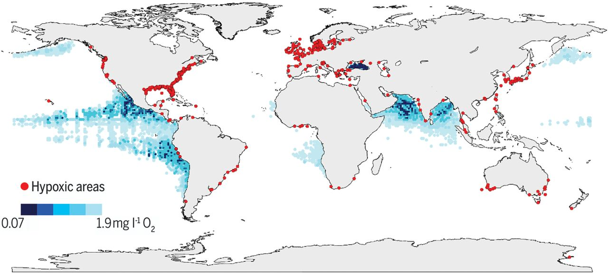

```{r setup, include=FALSE}
library(learnr)
library(knitr)
library(tutorial.helpers)
library(seacarb)
library(marelac)
knitr::opts_chunk$set(echo = FALSE)
knitr::opts_chunk$set(out.width = '90%') 
```

## Overview

The aim of today is to show you how you can use R to calculate ocean chemistry variables. We will calculate oxygen solubility in seawater, and evaluate how increasing temperatures change oxygen solubility. We will also explore the marine carbonate chemistry system, using R to derive the Revelle factors we discussed in our Monday lecture. 

Before anything else, make sure you fill in your name and ID in the next field.

```{r info-section, child = system.file("child_documents/info_section.Rmd", package = "tutorial.helpers")}
```

## Purpose and outcomes of activity

By the end of today's session, you should be able to:

\* use R to calculate the solubility of a gas in seawater

\* use R to solve the marine carbonate chemistry system

\* derive the 'Revelle' or buffer factors for marine CO2 uptake

## Ocean deoxygenation - background (15 minutes)

In the monday lecture we discussed how salinity and temperature control the solubility of gasses in seawater. Can you remember what the links where?
```{r ocean-deoxygenation-1, echo=FALSE}
question("Which of the following statements are correct?",
  answer("Gas solubility increases with decreasing temperature", correct = TRUE),
  answer("Gas solubility decreases with increasing salinity", correct = TRUE),
  answer("Gas solubility increases with increasing salinity"),
  answer("Gas solubility decreases with decreasing temperature"),
  random_answer_order = TRUE,
  allow_retry = TRUE
)
```

The link between changing temperatures and gas solubility is incredibly relevant and topical when it comes to oxygen. Take a few minutes to look at the figure below, which is taken from a paper in Science (Breitburg et al., 2018, https://www.science.org/doi/full/10.1126/science.aam7240). It shows the different areas in the world that are experiencing low oxygen conditions and hypoxia. Some of these areas will only experience this seasonally, when waters become stratified as the surface heats up. Other are permanently low in oxygen ('oxygen-minimum-zones'), which is generally because of upwelling that brings nutrients to the surface, which leads to high productivity in the surface, and a lot of oxygen consumption in the deeper layers as all that organic matter gets exported.

{width="14cm"}
Take a look at the figure again, and find Aotearoa/New Zealand. Are there low oxygen zones indicated? Does that make sense? keep your answer short and make it fit within the box.
```{r ocean-deoxygenation-2}
  question_text("What area is indicated as a low oxygen zone in Aotearoa/New Zealand? Does that make sense?",
    answer(NULL, correct = TRUE),
    allow_retry = TRUE,
    try_again_button = "Edit Answer",
    incorrect = NULL,
    rows = 5)
```

Now proceed to the next step.

## Calculating gas solubility in the ocean (20 minutes)

The solubility of a gas is dependent on salinity and temperature. R has quite a convenient package called 'marelac' (https://cran.r-project.org/web/packages/marelac/marelac.pdf), which has a lot of conversions, constants, equations etc. that are useful for aquatic science (marelac = MArine, Riverine, Estuarine, LAcustrine, and Coastal science). We will use the function 'gas_O2sat' from this package to calculate the saturation concentration of oxygen in water. 
Run the code below to get the oxygen concentration in water.
```{r ocean-deoxygenation-3, exercise=TRUE}
O2conc <- gas_O2sat()
print(O2conc)
```
Remember from previous R courses, when you call a function without providing any parameters, it will use the default values. In the case of 'gas_O2sat', it will assume a salinity of 35 and a temperature of 25 degrees Celsius. If we want to choose our parameters, we need to name them explicitly. The code below calls the parameter for salinity ('S') and for temperature ('t') explicitly.
Change the temperature to 15 degrees Celsius - what concentration do you get now?
```{r ocean-deoxygenation-4, exercise=TRUE}
O2conc <- gas_O2sat(S=35,t=25)
print(O2conc)
```
```{r ocean-deoxygenation-5, echo=FALSE}
question("What is the O2 concentration for a temperature of 15 degrees Celsius??",
  answer("6.75"),
  answer("8.12", correct = TRUE),
  answer("7.56"),
  random_answer_order = TRUE,
  allow_retry = TRUE
)
```

The oxygen concentration is reported in mg $O_2$ /L. In biogeochemistry, it makes more sense to report concentration in moles/L (as we discussed during the Monday lectures). To convert from grams to moles, we need to use the molecular weigh of oxygen. Conveniently, marelac has another function called 'molweight' which gives us the molecular weight of any molecule:
```{r ocean-deoxygenation-6, exercise=TRUE}
O2molweight <- molweight("O2")
print(O2molweight)
```
The molecular weight is given in g/moles. If we add this to our calculation, we get
```{r ocean-deoxygenation-7, exercise=TRUE}
O2molweight <- molweight("O2")
O2conc <- gas_O2sat(S=35,t=15)/O2molweight
print(O2conc)
```
What units is the reported oxygen concentration in now? Remember that gas_O2sat returns a value in mg $O_2$/L, and the molecular weight is given in g/moles. Putting that together gives us
$$ \frac{mg \ O_2}{L} / \frac{g}{moles} $$
```{r ocean-deoxygenation-8, echo=FALSE}
question("What are the units for the O2 concentration?",
  answer("mmol O2/L", correct = TRUE),
  answer("mg O2/g"),
  answer("mg O2/mol"),
  random_answer_order = TRUE,
  allow_retry = TRUE
)
```

Ok, so we know how to calculate the fully air-saturated concentration of oxygen in seawater, and we can convert it to the correct units (mmol $O_2$/L). Let us now use this to estimate the change in oxygen concentration with ongoing ocean warming.

DO SIMPLE EXCERCISE TO CHANGE TEMPERATURE AND PLOT THE O2 CONCENTRATION

SAY SOMETHING ABOUT STRATIFICATION AS WELL

Now proceed to the next step.

## Ocean carbonate chemistry (20 minutes)

DO EASY CO2 gas calculations

MOVE TO ACID_BASE

```{r gas-dissolution-2, echo=FALSE}
question("What is the extra complicating factor for the dissolution of CO2 in seawater?",
  answer("CO2 in seawater behaves as an acid", correct = TRUE),
  answer("There is very little CO2 in the atmosphere (compared to oxygen)"),
  answer("There is a lot of CO2 in the atmosphere (compared to methane)"),
  answer("I really should have attended more of the workshops"),
  random_answer_order = TRUE,
  allow_retry = TRUE
)

```
So the solubility of $CO_2$ does not only depend on salinity and temperature, but also on the TA of seawater. This means we will have to solve the carbonate system before we can calculate the air-sea flux. These calculations are not trivial, and are well beyond what is expected of a marine science major. Luckily, there are several tools that can help us to calculate the carbonate system. Have a look on the web and see if you can find one
```{r WebSearch-4}
  question_text("Name one tool to calculate carbonate chemistry, other than the one we will use here (R-package seacarb))",
    answer(NULL, correct = TRUE),
    allow_retry = TRUE,
    try_again_button = "Edit Answer",
    incorrect = NULL,
    rows = 1)
```

## Deriving Revelle factors (45 minutes)

LEAD IN THE REVELLE FACTORS, FIND FIGURE THAT WILL BE USED IN THE LECTURE

We will be using the R-package 'seacarb' (check it out at https://cran.r-project.org/web/packages/seacarb/seacarb.pdf). The use of it is fairly simple, as we only need one line of code to find the solution, and the package includes a lot of default parameter choices. Important to remember is that concentrations of DIC and TA are given in $mol \ kg^{-1}$, and NOT $\mu mol \ kg^{-1}$. The piece of code below calculates the pH of the ocean for increasing levels of atmospheric $CO_2$.
```{r carbonate-chemistry, exercise=TRUE}
pCO2.vector <- c(280,300,320,340,360,380,400,420)

plot(x=NULL,y=NULL,xlim=c(280,500),ylim=c(7.6,8.3),
     xlab=expression(pCO['2']~(ppm)),ylab=expression(pH))
for (i in 1:length(pCO2.vector)){
  points(x=pCO2.vector[i],y=carb(flag=24,var1=pCO2.vector[i],var2=2300*1e-6, S=35, T=25)$pH,
         pch=16,cex=1.2,col="black") 
}
```


```{r download-answers, child = system.file("child_documents/download_answers.Rmd", package = "tutorial.helpers")}
```
