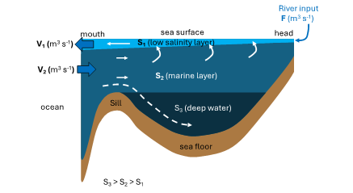

```{r setup, include=FALSE}
library(learnr)
library(knitr)
library(tutorial.helpers)
library(ReacTran)
library(seacarb)
knitr::opts_chunk$set(echo = FALSE)
knitr::opts_chunk$set(out.width = '90%') 
```

## Overview

The aim of today is to bring together the different modules of the past 9 weeks into a single model of the carbon cycle in Otago harbour. In this step-by-step tutorial, we will gradually build up the required model code to be able to run this model, and at each step you will put in the data you collected over the past weeks. At the end of the tutorial, you will save the answers you supplied as a html file, and you will submit this file as your report for this module.

Before anything else, make sure you fill in your name and ID in the next field.

```{r info-section, child = system.file("child_documents/info_section.Rmd", package = "tutorial.helpers")}
```

## Purpose and outcomes of activity

By the end of today's session, you should be able to:

\* Understand how the different aspects of oceanography are complementary when we want to fully understand a marine system

\* Find necessary information about your study site on the web

\* Understand which lines of code relate to which real-life process

\* Use a simple pre-coded carbon cycle box model to answer environmentally relevant questions (which will be very useful for the last module of this paper!)

## Setting up the Harbour circulation (30 minutes)

Last year during MARI201 (The physical ocean), you learned how to build a box model of fjord circulation (the figure might revive your memory).

{width="14cm"}

Conveniently, fjord circulation is very similar to the circulation in harbours and estuaries. This means we can use the same principles (The so-called 'Knudsen Relations') to set up the physical circulation of Otago harbour. The equations are $$Q_{ocean,in} = \frac{S_{surface}*Q_{freshwater}}{S_{deep}-S_{surface}} $$ $$Q_{ocean,out} = \frac{S_{deep}*Q_{freshwater}}{S_{deep}-S_{surface}} $$ See that we use slightly different parameters for water flow (Q instead of F), and we explicitly name the salinity values for the surface and deep layer (rather than 1 and 2), and the freshwater flux ($Q_{freshwater}$). The rest of the model is identical. In the case of Otago harbour, we only have the Owheo as significant river input, so we can make the name even more specific and use $Q_{Owheo}$. For this circulation model, there are thus three parameters in total: salinity for the surface layer ($S_{surface}$), salinity for the deep layer ($S_{deep}$), and freshwater input ($Q_{Owheo}$).

We have measured the salinity in week 37, but we not have not measured the flow of the Owheo. This happens often - we are not always able to measure every parameter that is potentially important. Luckily for us, the internet exists, and a lot of information is available online. Do a quick web search and find the background discharge (in m3/s -\> CHECK UNITS!) of the Owheo River (hint: the Otago Regional Council regularly monitors rivers).

```{r WebSearch-1}
  question_text("What is the background flow of the Owheo in m3/s?",
    answer(NULL, correct = TRUE),
    allow_retry = TRUE,
    try_again_button = "Edit Answer",
    incorrect = NULL,
    rows = 1)
```

Before running the modelm have a look at the code chunk below, and answer the following questions:
```{r parameter-1}
  question_text("Which parameter represents the surface salinity?",
    answer("S.surface", correct = TRUE),
    allow_retry = TRUE,
    try_again_button = "Edit Answer",
    incorrect = "Try again!",
    rows = 1)
```

```{r parameter-2}
  question_text("Which parameter represents the water flux from the ocean?",
    answer("Q_ocean_in", correct = TRUE),
    allow_retry = TRUE,
    try_again_button = "Edit Answer",
    incorrect = "Try again!",
    rows = 1)
```
Now, try and run the code chunk

```{r harbour-circulation, exercise=TRUE}

pars <- c(
  S.surface = 33,  # [-] Salinity surface water layer
  S.deep    = 35,  # [-] Salinity surface water layer
  Q.Owheo   = 0.36 # [m3/s]
)

OH.box <- function(t, state, parameters)
{
  with(as.list(c(state, parameters)),{

    ### Fluxes
    # estuarine exchange 
    Q_ocean_in  <- (S.surface*Q.Owheo) / (S.deep-S.surface)
    Q_ocean_out <- (S.deep*Q.Owheo) / (S.deep-S.surface)
    
    ### assemble SV vector
    SV.return <- c(0) 
    
    # return list
    return(list(
      # Total rates of change
      SV.return, 
      # water volume fluxes
      Q_ocean_in = Q_ocean_in, Q_ocean_out = Q_ocean_out)
    )
  })
}  # end of model equations

solution <- steady(y = c(0), func = OH.box, method = "stode", positive=T, parms = pars)
print(paste("Water flux from ocean = ",solution$Q_ocean_in," m3/s"))
print(paste("Water flux to ocean = ",solution$Q_ocean_out," m3/s"))
```

Now, replace the salinity values with the salinity you measured during Week 37 ('Biological Oceanography'), change the Owheo discharge with the value you found online, and rerun the model. Using your own values, what is the calculated water flow from the harbour to the ocean?

```{r water-flow-1}
  question_text("What is the calculated water flow from the harbour to the ocean?",
    answer(NULL, correct = TRUE),
    allow_retry = TRUE,
    try_again_button = "Edit Answer",
    incorrect = NULL,
    rows = 1)
```

During the Lagrangian module in week 41-42, you derived a residence time of material in the harbour. Our model also allows us to calculate a residence time. We are not tracking individual particles, so we are using a Eulerian approach, and the residence time can be calculated by dividing the amount of water in the reservoir by the net flux of water out of the reservoir. 
$$ RT = \frac{V}{Q}$$
In our very first week (week 29), we have determined the water volume of the harbour, and we you just were asked to report the flux of water to the ocean (Q_ocean_out). Use those two values to calculate the residence time, and answer the question below (answer concisely, and fit the answer in the provided box.)

```{r water-flow-2}
  question_text("How does our modelled residence time compare to the one derived from the Lagrangian model? What would explain the difference?",
    answer(NULL, correct = TRUE),
    allow_retry = TRUE,
    try_again_button = "Edit Answer",
    incorrect = NULL,
    rows = 5)
```

Now proceed to the next step.

## Adding dissolved tracers (30 minutes)

Now that we have our circulation going, we can add in dissolved tracers. Since we are interested in the carbon cycle, we will include Dissolved Inorganic Carbon (DIC) and Total Alkalinity (TA). Take a minute to think about what we discussed in week 34 and answer the following questions

```{r DIC, echo=FALSE}
question("What does Dissolved Inorganic Carbon (DIC) mean?",
  answer("All the carbon in the ocean"),
  answer("All the CO2 that is dissolved in seawater", correct = TRUE),
  answer("Carbon that is locked into phytoplankton"),
  answer("Water acidity"),
  random_answer_order = TRUE,
  allow_retry = TRUE
)
```

```{r TA, echo=FALSE}
question("Why do we care about Total Alkalinity (TA)?",
  answer("TA is a metric for productivity"),
  answer("TA allows us to calculate water fluxes"),
  answer("TA determines how much CO2 can be dissolved in seawater", correct = TRUE),
  answer("I really should have attended more of the workshops"),
  random_answer_order = TRUE,
  allow_retry = TRUE
)
```

To add dissolved tracers to our model, we need to define the 'boundary conditions'. These are the concentrations at the boundary of our model, which in our case will be the Owheo River and the ocean. Additionally, since we are now going to work with concentrations, we need to know the volume of our box (the harbour).

ADD FIGURE

If the weather was good during the Polaris trip of week 34, we have measured alkalinity and DIC at the open ocean boundary of the harbour. If not, we will need to make an 'educated guess'. If you were doing this 'for real', you would be searching the web for available data - take 10 mins and try to find a relevant database for ocean carbon chemistry measurements on the Otago shelf (Hint: remember the Munida transect we talked about in week 34, and that we are looking for 'ocean carbon' measurements)

```{r WebSearch-2}
  question_text("Which database exists that has ocean carbon measurements on the Otago shelf?",
    answer(NULL, correct = TRUE),
    allow_retry = TRUE,
    try_again_button = "Edit Answer",
    incorrect = NULL,
    rows = 1)
```

you will notice you need to log in to access the database, which you do not need to do. Instead, we can use a TA concentration of 2300 $\mu mol \ kg^{-1}$ and a DIC concentration of 2100 $\mu mol \ kg^{-1}$. We also need to provide TA and DIC concentrations for the Owheo. These measurements do not (yet) exist, but we can assume that other rivers on the eastcoast of the South island have very similar TA and DIC concentrations. We can also assume that TA = DIC for riverwater. Do a web search (use Google Scholar) a find a reference that has the information you need 

```{r WebSearch-3}
  question_text("Supply a reference (Author, year, journal) that has TA or DIC measurements for a eastcoast Otago river",
    answer(NULL, correct = TRUE),
    allow_retry = TRUE,
    try_again_button = "Edit Answer",
    incorrect = NULL,
    rows = 1)
```

Before running the model, take a look at the code (below). There is a conversion factor of 1.023 (see at the end of L25), which is to convert the TA and DIC concentrations from $\mu mol \ kg^{-1}$ seawater to $\mu mol \ L^{-1}$ (remember that very first lab in week 29?). There is also a slightly more complicated conversion factor in that line ($1e3*3600*365.25$, 1e3 = $10^{10}$ = 1000). This is to convert the water flow from m3/s to what unit?

```{r unit-conversion-1}
  question_text("What unit does m3/s convert to if you multiply it with 1000 x 3600 x 365.25?",
    answer("dm3/yr", correct = TRUE),
    answer("dm3/year", correct = TRUE),
    answer("dm3/y", correct = TRUE),
    answer("dm3 yr-1", correct = TRUE),
    answer("dm3 year-1", correct = TRUE),
    answer("dm3 y-1", correct = TRUE),
    allow_retry = TRUE,
    try_again_button = "Edit Answer",
    incorrect = "Try again!",
    rows = 1)
```
Now put in your values (check your units!) and run the model. 

```{r dissolved-tracers, exercise=TRUE}
pars <- list(
  TA.Owheo  = 500.,  # [umol/kg] Concentration of TA in the Owheo River
  DIC.Owheo = 500.,  # [umol/kg] Concentration of DIC in the Owheo River
  TA.ocean  = 2300., # [umol/kg] Concentration of TA in the open ocean
  DIC.ocean = 2100., # [umol/kg] Concentration of DIC in the open ocean
  
  V.harbour = 0.194*1e12, #[dm3] Volume of Otago harbour
  
  S.surface = 33.,  # [-] Salinity surface water layer
  S.deep    = 35.,  # [-] Salinity surface water layer
  Q.Owheo   = 0.36  # [m3/s]
)

OH.box <- function(t, state, parameters)
{
  with(as.list(c(state, parameters)),{
    
    TA.harbour  <- state[1]  # TA in harbour
    DIC.harbour <- state[2]  # DIC in harbour
    
    ### Fluxes
    # estuarine exchange [umol yr-1]
    Q_ocean_in  <- (S.surface*Q.Owheo) / (S.deep-S.surface)
    Q_ocean_out <- (S.deep*Q.Owheo) / (S.deep-S.surface)
    
    F_TA_ocean_in   <- (Q_ocean_in*1e3*3600*365.25)  * (TA.ocean*1.023)
    F_TA_ocean_out  <- (Q_ocean_out*1e3*3600*365.25) * (TA.harbour*1.023)
    
    F_DIC_ocean_in  <- (Q_ocean_in*1e3*3600*365.25)  * (DIC.ocean*1.023)
    F_DIC_ocean_out <- (Q_ocean_out*1e3*3600*365.25) * (DIC.harbour*1.023)
    
    # riverine input [umol yr-1]
    F_TA_owheo  <- (Q.Owheo*1e3*3600*365.25) * (TA.Owheo)
    F_DIC_owheo <- (Q.Owheo*1e3*3600*365.25) * (DIC.Owheo)
    
    ### Mass balances 
    ddt.TA.harbour  <- (F_TA_ocean_in  - F_TA_ocean_out  + F_TA_owheo  )/(V.harbour/1.023)
    ddt.DIC.harbour <- (F_DIC_ocean_in - F_DIC_ocean_out + F_DIC_owheo )/(V.harbour/1.023)
    
    ### assemble SV vector
    SV.return <- c(ddt.TA.harbour,ddt.DIC.harbour) 
    
    # return list
    return(list(
      # Total rates of change
      SV.return, 
      # water volume fluxes
      Q_ocean_in = Q_ocean_in, Q_ocean_out = Q_ocean_out)
    )
  })
}  # end of model equations

solution <- steady(y = c(pars$TA.ocean,pars$DIC.ocean), func = OH.box, method = "stode", positive=T, parms = pars)
print(paste("TA concentration in the Harbour = ", solution$y[[1]]," umol/kg"))
print(paste("DIC concentration in the Harbour = ",solution$y[[2]]," umol/kg"))
```

Try and increase the discharge of the Owheo river (hint:Q.Owheo) (e.g., increase it with a factor 1000). 

```{r water-flow-3}
  question_text("What happens to the concentration of TA in the harbour when you increase the Owheo water flux?",
    answer(NULL, correct = TRUE),
    allow_retry = TRUE,
    try_again_button = "Edit Answer",
    incorrect = NULL,
    rows = 1)
```

At this point, we have not included any reactions or fluxes other than the water input at river boundary and the water flushing at the ocean boundary, so both TA and DIC act as "passive" tracers (they are not reacting but are only transported). This is almost the same as the passive tracers you used in weeks 31 and 32 for the Lagrangian particle tracking module, with one major difference. It is this difference that makes these tracers behave 'Eulerian' and not 'Lagrangian'.

```{r passive-tracers, echo=FALSE}
question("What is the difference between the passive tracers here and the ones used during the Lagrangian particle tracking?",
  answer("TA and DIC are dissolved", correct = TRUE),
  answer("The particles in the Lagrangian module did not sink"),
  answer("We were releasing many more tracers at once"),
  answer("I really should have attended more of the workshops"),
  random_answer_order = TRUE,
  allow_retry = TRUE
)
```

Now proceed to the next step.

## Adding air-sea gas exchange (20 minutes)

We have dissolved tracers (TA and DIC) that are transported into the harbour via the Owheo river, and that exchange at the open boundary. We are modelling the carbon cycle, and there is one (very) important flux we have not yet included: exchange of $CO_2$ gas between atmosphere and seawater. Do you remember (from week 34) Which parameters control how much gas can be dissolved in water?

```{r gas-dissolution-1, echo=FALSE}
question("Which parameters control gas dissolution ?",
  answer("Salinity", correct = TRUE),
  answer("Temperature", correct = TRUE),
  answer("Windspeed"),
  answer("Ocean colour"),
  answer("I really should have attended more of the workshops"),
  random_answer_order = TRUE,
  allow_retry = TRUE
)
```

By adding air-sea gas exchange of $CO_2$, our conceptual box model now looks like this (note the extra arrow) 

ADD FIGURE

Calculating air-sea exchange can be done very simply if we know the gas concentration in the atmosphere ($pCO_2$) and the gas concentration in the water ($[CO_2]_{aq}$):
$$ F_{air-sea} = k_{piston}(pCO_2 - [CO_2]_{aq}) $$
In this equation, $k_{piston}$ is simply a parameter that tells how fast the gas goes towards equilibrium. in week 34 we discussed how the wind velocity is a major control on air-sea gas exchange. To calculate the air-sea exchange of $CO_2$, there is one complicating factor, namely (again discussed during week 34):


## Adding reactions (20 minutes)


```{r download-answers, child = system.file("child_documents/download_answers.Rmd", package = "tutorial.helpers")}
```
