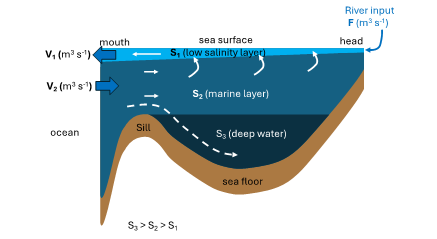

```{r setup, include=FALSE}
library(learnr)
library(knitr)
library(tutorial.helpers)
library(ReacTran)
library(seacarb)
knitr::opts_chunk$set(echo = FALSE)
knitr::opts_chunk$set(out.width = '90%') 
```

## Overview

What is the aim of today?

## Purpose and outcomes of activity

What will we learn today?

## Setting up the Harbour circulation (10 minutes)

Last year during MARI201 (The physical ocean), you learned how to build a box model of fjord circulation (the figure might revive your memory).

{width=14cm}

Conveniently, fjord circulation is very similar to the circulation in harbours and estuaries. This means we can use the same principles ('Knudsen Relations') to set up the physical circulation of Otago harbour. See that we use slightly different parameters for water flow (Q instead of F), but the rest of the model setup is identical. We have three parameters, salinity for the surface layer (S.surface), salinity for the deep layer (S.deep), and freshwater input (Q.Owheo). In the case of Otago harbour, we only have the Owheo as significant river input. Try and run the code chunk below, and then replace the parameters with the values you measured during Week XXX, and rerun the model.

```{r harbour-circulation, exercise=TRUE}

pars <- c(
  S.surface = 33,  # [-] Salinity surface water layer
  S.deep    = 35,  # [-] Salinity surface water layer
  Q.Owheo   = 0.36 # [m3/s]
)

OH.box <- function(t, state, parameters)
{
  with(as.list(c(state, parameters)),{

    ### Fluxes
    # estuarine exchange [umol yr-1]
    Q_ocean_in  <- (S.surface*Q.Owheo) / (S.deep-S.surface)
    Q_ocean_out <- (S.deep*Q.Owheo) / (S.deep-S.surface)
    
    ### assemble SV vector
    SV.return <- c(0) 
    
    # return list
    return(list(
      # Total rates of change
      SV.return, 
      # water volume fluxes
      Q_ocean_in = Q_ocean_in, Q_ocean_out = Q_ocean_out)
    )
  })
}  # end of model equations

solution <- steady(y = c(0), func = OH.box, method = "stode", positive=T, parms = pars)
print(paste("Water flux from ocean = ",solution$Q_ocean_in," m3/s"))
print(paste("Water flux to ocean = ",solution$Q_ocean_out," m3/s"))
```

Using your own measured values, what is the calculated water flow from the ocean to the harbour (Hint: 'Q_ocean_in')?

```{r water-flow}
  question_text(NULL,
    answer(NULL, correct = TRUE),
    allow_retry = TRUE,
    try_again_button = "Edit Answer",
    incorrect = NULL,
    rows = 3)
```

## Adding dissolved tracers (20 minutes)

Now that we have our circulation working, we can add in dissolved tracers. Since we are interested in the carbon cycle, we will include Dissolved Inorganic Carbon (DIC) and Total Alkalinity (TA). Take a minute to think about what we discussed in week 34 and answer the following questions 

```{r DIC, echo=FALSE}
question("What does Dissolved Inorganic Carbon (DIC) mean?",
  answer("All the carbon in the ocean"),
  answer("All the CO2 that is dissolved in seawater", correct = TRUE),
  answer("Carbon that is locked into phytoplankton"),
  answer("Water acidity"),
  random_answer_order = TRUE,
  allow_retry = TRUE
)
```

```{r TA, echo=FALSE}
question("Why do we care about Total Alkalinity (TA)?",
  answer("TA is a metric for productivity"),
  answer("TA allows us to calculate water fluxes"),
  answer("TA determines how much CO2 can be dissolved in seawater", correct = TRUE),
  answer("I really should have attended more of the workshops"),
  random_answer_order = TRUE,
  allow_retry = TRUE
)
```

To add dissolved tracers to our model, we need to define the 'boundary conditions'. These are the concentrations at the boundary of our model, which in our case will be the Owheo River, and the ocean. Again, put in the values you have measured during the previous weeks, and run the model.

```{r dissolved-tracers, exercise=TRUE}
pars <- list(
  pCO2      = 280.,  # [ppm] atmospheric concentration of CO2
  TA.Owheo  = 500.,  # [umol/kg] Concentration of TA in the Owheo River
  DIC.Owheo = 500.,  # [umol/kg] Concentration of DIC in the Owheo River
  TA.ocean  = 2300., # [umol/kg] Concentration of TA in the open ocean
  DIC.ocean = 2100., # [umol/kg] Concentration of DIC in the open ocean
  
  S.surface = 33.,  # [-] Salinity surface water layer
  S.deep    = 35.,  # [-] Salinity surface water layer
  Q.Owheo   = 0.36  # [m3/s]
)

OH.box <- function(t, state, parameters)
{
  with(as.list(c(state, parameters)),{
    
    TA.harbour  <- state[1]  # TA in harbour
    DIC.harbour <- state[2]  # DIC in harbour
    
    ### Fluxes
    # estuarine exchange [umol yr-1]
    Q_ocean_in  <- (S.surface*Q.Owheo) / (S.deep-S.surface)
    Q_ocean_out <- (S.deep*Q.Owheo) / (S.deep-S.surface)
    
    F_TA_ocean_in   <- (Q_ocean_in*1e3*3600*365.25)  * (TA.ocean*1.023)
    F_TA_ocean_out  <- (Q_ocean_out*1e3*3600*365.25) * (TA.harbour*1.023)
    
    F_DIC_ocean_in  <- (Q_ocean_in*1e3*3600*365.25)  * (DIC.ocean*1.023)
    F_DIC_ocean_out <- (Q_ocean_out*1e3*3600*365.25) * (DIC.harbour*1.023)
    
    # riverine input [umol yr-1]
    F_TA_owheo  <- (Q.Owheo*1e3*3600*365.25) * (TA.Owheo)
    F_DIC_owheo <- (Q.Owheo*1e3*3600*365.25) * (DIC.Owheo)
    
    ### Mass balances 
    ddt.TA.harbour  <- (F_TA_ocean_in  - F_TA_ocean_out  + F_TA_owheo  )/(0.194*1e12/1.023)
    ddt.DIC.harbour <- (F_DIC_ocean_in - F_DIC_ocean_out + F_DIC_owheo )/(0.194*1e12/1.023)
    
    ### assemble SV vector
    SV.return <- c(ddt.TA.harbour,ddt.DIC.harbour) 
    
    # return list
    return(list(
      # Total rates of change
      SV.return, 
      # water volume fluxes
      Q_ocean_in = Q_ocean_in, Q_ocean_out = Q_ocean_out)
    )
  })
}  # end of model equations

solution <- steady(y = c(pars$TA.ocean,pars$DIC.ocean), func = OH.box, method = "stode", positive=T, parms = pars)
print(paste("TA concentration in the Harbour = ", solution$y[[1]]," umol/kg"))
print(paste("DIC concentration in the Harbour = ",solution$y[[2]]," umol/kg"))
```

Try and increase the flow of the Owheo river, what happens to the concentration of TA in the harbour?

```{r water-flow-2}
  question_text(NULL,
    answer(NULL, correct = TRUE),
    allow_retry = TRUE,
    try_again_button = "Edit Answer",
    incorrect = NULL,
    rows = 3)
```

We are not including any reactions or exchange other than the water input at river boundary and the exchange at the ocean boundary, so both TA and DIC should act as "passive" tracers. This is almost the same as the passive tracers you used in weeks 31 and 32 for the Lagrangian particle tracking, with one major difference. It is this difference that makes these tracers behave 'Eulerian' and not 'Lagrangian'.

```{r passive-tracers, echo=FALSE}
question("What is the difference between the passive tracers here and the ones used during the Lagrangian particle tracking?",
  answer("TA and DIC are dissolved", correct = TRUE),
  answer("The particles in the Lagrangian module did not sink"),
  answer("We were releasing many more tracers at once"),
  answer("I really should have attended more of the workshops"),
  random_answer_order = TRUE,
  allow_retry = TRUE
)
```
